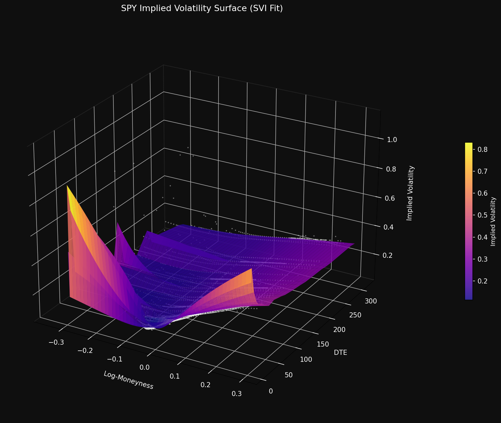
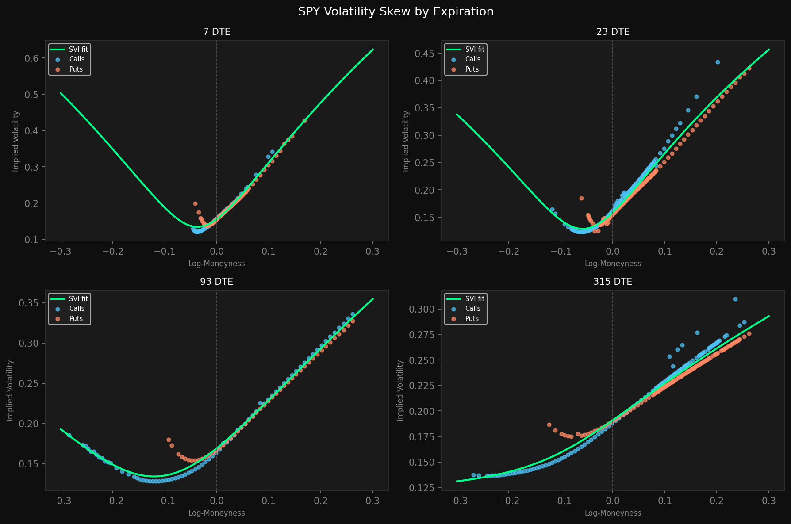
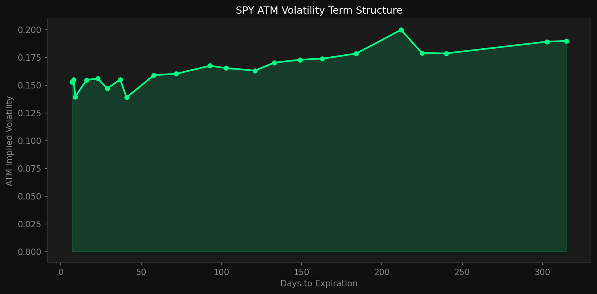

# SPY Implied Volatility Surface
### Black-Scholes Inversion | SVI Parametrization | 22 Expirations | May 2026

---

## Overview

This project builds a complete implied volatility surface for SPY options from scratch using only open-source data and tools. It pulls live options data, applies liquidity filters, computes implied volatility via Black-Scholes inversion, fits a smooth surface using the industry-standard SVI parametrization, and produces publication-quality visualizations.

The same workflow is used by options desks at hedge funds and banks — this implementation makes it fully reproducible with publicly available data.

---

## Results







---

## Key Findings

- **6,714 raw contracts** across 22 expirations (7–315 DTE), narrowed to **4,809 liquid contracts** after filtering
- **Dividend adjustment is critical** — omitting SPY's 1.3% dividend yield produces a 32% systematic downward bias in IV estimates, raising benchmark correlation from 0.83 to 0.93
- **Pronounced negative skew** confirmed for short-dated expirations — puts are significantly more expensive than equidistant calls, consistent with the well-documented equity index put skew
- **Upward sloping ATM term structure** — ATM IV rises from ~14% at 7 DTE to ~19–20% beyond 200 DTE, consistent with a low-to-moderate volatility regime
- **All 22 expirations fitted successfully** with SVI — parameter bounds diagnostics identify sparse liquidity slices reliably

---

## Architecture

```
iv-surface-fitting/
├── fetcher.py              # Module 1 — pull SPY options chain from yfinance
├── cleaner.py              # Module 2 — liquidity filtering + log-moneyness
├── black_scholes.py        # Module 3 — BS pricer + Newton-Raphson IV solver
├── svi.py                  # Module 4 — SVI surface fitting
├── plotter.py              # Module 5 — 3D surface + skew + term structure plots
├── data/                   # Parquet files (gitignored)
│   ├── raw/
│   ├── clean/
│   ├── iv/
│   └── surface/
├── plots/                  # Output visualizations
│   ├── SPY_3d_surface.png
│   ├── SPY_skew_slices.png
│   └── SPY_term_structure.png
└── requirements.txt
```

---

## How to Run

**Install dependencies:**
```bash
pip install pandas numpy scipy yfinance matplotlib pyarrow
```

**Run each module in order:**
```bash
python fetcher.py           # Pull live SPY options chain (~30 seconds)
python cleaner.py           # Apply liquidity filters
python black_scholes.py     # Compute IV via BS inversion
python svi.py               # Fit SVI surface across all expirations
python plotter.py           # Generate visualizations
```

Each module reads from and writes to the `data/` folder as `.parquet` files.

---

## Module Details

### `fetcher.py` — Data Collection
Pulls the full SPY options chain from Yahoo Finance across all expirations between 7 and 365 DTE. Fetches spot price, strike, bid, ask, volume, open interest, and expiration for every contract. Saves raw chain as parquet.

- **Input**: Yahoo Finance (live)
- **Output**: `data/raw/SPY_raw.parquet` — 6,714 contracts, 22 expirations

### `cleaner.py` — Liquidity Filtering
Applies 6 sequential filters to remove illiquid, stale, and uninformative contracts. Computes log-moneyness $k = \ln(S/K)$ for each surviving contract.

| Filter | Contracts | Survival |
|---|---|---|
| Raw chain | 6,714 | 100.0% |
| Zero-bid | 6,455 | 96.1% |
| Zero-volume | 6,230 | 92.8% |
| Zero-mid | 6,230 | 92.8% |
| Wide spread (>50% of mid) | 6,076 | 90.5% |
| Moneyness [0.7, 1.3] | 4,827 | 71.9% |
| IV sanity (0, 500%) | 4,827 | 71.9% |

- **Input**: `data/raw/SPY_raw.parquet`
- **Output**: `data/clean/SPY_clean.parquet` — 4,827 contracts

### `black_scholes.py` — IV Computation
Implements the dividend-adjusted Black-Scholes pricing formula and inverts it numerically to recover implied volatility. Uses Newton-Raphson iteration as the primary solver with Brent's method as a fallback for near-zero vega contracts. Risk-free rate set to 4.3% (3-month T-bill, May 2026), dividend yield set to 1.3% for SPY.

- **Input**: `data/clean/SPY_clean.parquet`
- **Output**: `data/iv/SPY_iv.parquet` — 4,809 contracts with computed IV
- **Benchmark correlation**: 0.93 vs Yahoo Finance IV (median ratio: 0.993)

### `svi.py` — Surface Fitting
Fits the Stochastic Volatility Inspired (SVI) parametrization independently for each expiration using nonlinear least squares in total variance space $w(k) = \hat{\sigma}^2 T$. The SVI formula:

$$w(k) = a + b\left(\rho(k-m) + \sqrt{(k-m)^2 + \sigma^2}\right)$$

Generates a smooth surface evaluated on a 100-point log-moneyness grid per expiration.

- **Input**: `data/iv/SPY_iv.parquet`
- **Output**: `data/surface/SPY_svi_params.parquet`, `data/surface/SPY_svi_surface.parquet`
- **Fit success rate**: 22/22 expirations

### `plotter.py` — Visualization
Produces three publication-quality plots on a dark theme:
- **3D surface**: full IV surface with raw data scatter overlay
- **Skew slices**: SVI fit vs raw IV for 4 representative expirations
- **Term structure**: ATM IV as a function of DTE

- **Input**: `data/iv/`, `data/surface/`
- **Output**: `plots/SPY_3d_surface.png`, `plots/SPY_skew_slices.png`, `plots/SPY_term_structure.png`

---

## Engineering Notes

**datetime precision mismatch** — yfinance returns `datetime64[s]` index while parquet-serialized data loads as `datetime64[ms]`. Invisible to inspection but causes pandas index joins to silently fail. Fixed with explicit `.astype("datetime64[ns]")` normalization.

**dividend adjustment** — standard Black-Scholes implementations omit the continuous dividend yield. For SPY (q ≈ 1.3% annually), this produces a 32% systematic underestimation of IV. The Merton (1973) dividend-adjusted model is used throughout.

**Newton-Raphson instability** — the solver diverges for deep ITM/OTM contracts where vega approaches zero. Brent's method fallback recovers most of these cases. 17 contracts remain unresolvable and are dropped.

**SVI parameter bounds** — several expirations converge to bound values (b = 2.0, |ρ| = 0.999), reliably indicating sparse data in those slices rather than genuine extreme market conditions. These are flagged in the results.

---

## Limitations

- **Static snapshot** — surface constructed from a single day's data (May 24, 2026). A production system would update continuously and maintain a historical database.
- **Independent expiration fitting** — calendar spread arbitrage constraints are not enforced across expirations. The SSVI parametrization (Gatheral & Jacquier, 2014) would address this.
- **Survivorship bias in filtering** — the moneyness filter removes deep OTM contracts that carry the most tail risk information.
- **Single underlying** — SPY only. Single-stock options require additional adjustments for earnings events and less liquid chains.

---

## References

- Black, F. and Scholes, M. (1973). The pricing of options and corporate liabilities. *Journal of Political Economy*, 81(3), 637–654.
- Gatheral, J. (2004). A parsimonious arbitrage-free implied volatility parametrization. Presentation at Global Derivatives, Madrid.
- Gatheral, J. and Jacquier, A. (2014). Arbitrage-free SVI volatility surfaces. *Quantitative Finance*, 14(1), 59–71.
- Merton, R. C. (1973). Theory of rational option pricing. *Bell Journal of Economics*, 4(1), 141–183.
- Lee, R. (2004). The moment formula for implied volatility at extreme strikes. *Mathematical Finance*, 14(3), 469–480.

---

## Related Work

This project is part of a broader portfolio of quantitative finance research. See also:
- [statarb-signal-research](https://github.com/4Rbelaez/statarb-signal-research) — Cross-sectional mean-reversion strategy on S&P 500 equities, FF3 factor-neutralized, Sharpe 0.27

---

## About

Built as an independent research project exploring derivatives pricing and volatility surface construction.

Data: [yfinance](https://github.com/ranaroussi/yfinance) | [Ken French Data Library](https://mba.tuck.dartmouth.edu/pages/faculty/ken.french/data_library.html)
